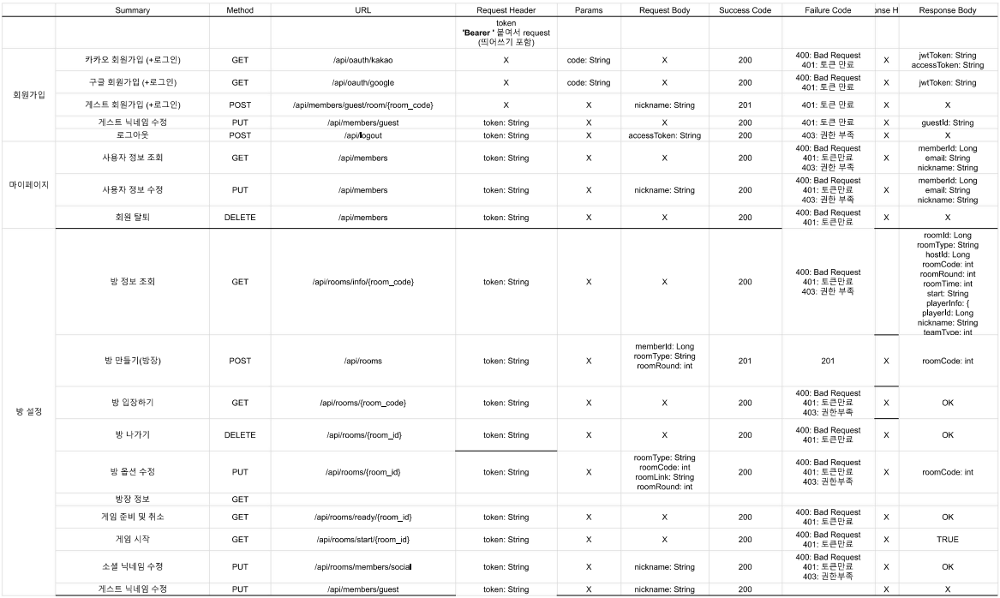
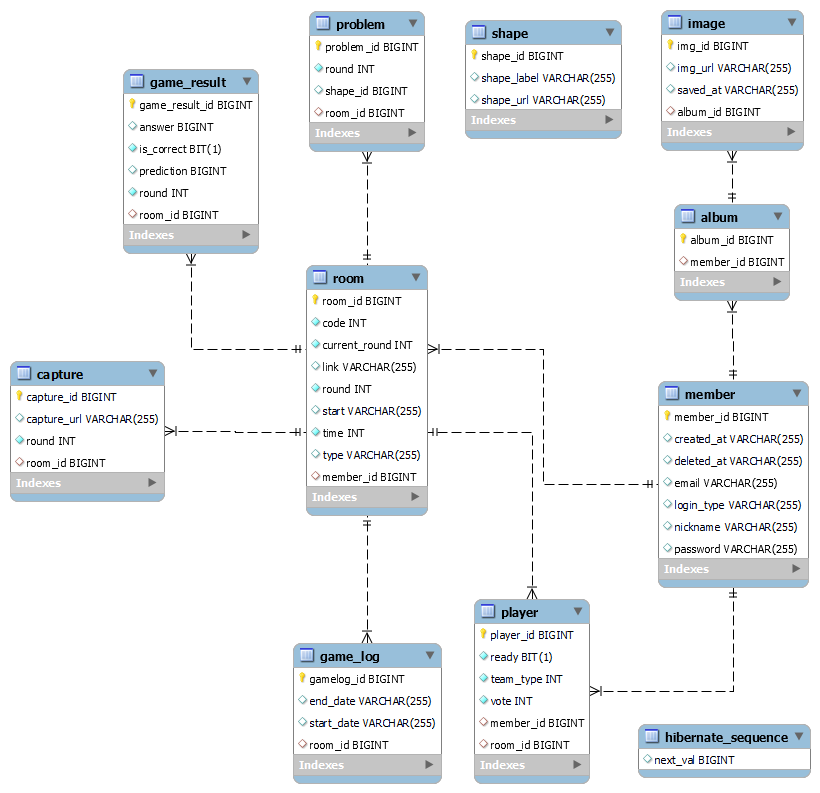
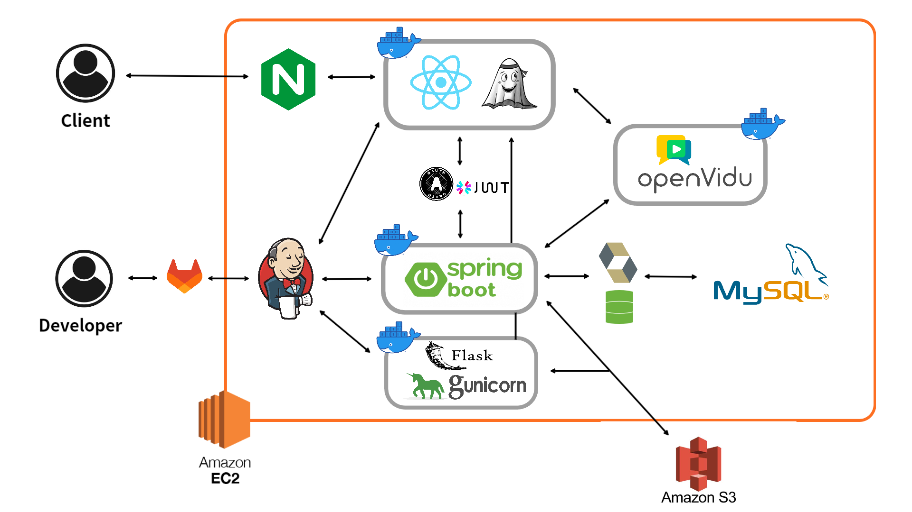

# [] WITH US

## 서비스 소개

---
다같이 도형을 만들고 AI가 맞추는 아이스브레이킹 게임, With Us!  

> With Us에서 몸을 움직이며, 사람들과의 어색함을 풀어보아요!  

프로젝트 기간: 2023.07.04 ~ 2023.08.18

## 기술 스택

- FrontEnd  
  **Language |**  
  **Framework |** React 18.2.0  
  **Engine |** Node 20.4.2  
  **Library |**

   
- BackEnd

  **Language |** Java 11  
  **Framework |** Spring Boot 2.7.13  
  **DB |** Spring Data JPA, MySQL 8.0.33  
  **Build Tool |** Gradle  
   
- AI  
  **Language |** Python 3.8.10  
  **Framework |** Flask

   

- WebRTC  
  Openvidu 2.28.0  
   
  
- Pose Detection  

   
  
- CI/CD  
  - AWS EC2
  - AWS S3
  - Docker
  - Nginx
  - Jenkins

---

## 팀 소개

|   이름    |          역할           | 
|:-------:|:---------------------:|
| 권기윤(팀장) | CI/CD AI | 
|   김예빈   |       Front-end       | 
|   이두현   |       Front-end       | 
|   이민영   |       Front-end       | 
|   우찬희   |       Back-end        | 
|   이지은   |       Back-end        | 

---

## 주요 기능

---
### 1. 로그인
  - 소셜 로그인(구글/카카오)
    
  - 게스트

### 2. 대기실
  - 닉네임 변경
  - 채팅

### 3. 게임   
  - 게임 진행
  - MVP 투표

  1. 게스트 ver  
     
  2. 로그인 ver  
     

### 4. 앨범
  - 사진 QR 저장
    

## API 명세

---
### [API 명세서 전체 보기](https://docs.google.com/spreadsheets/d/1_ibyCUzroQdF4HLyg2jRdpOz7aF99Q1AtgkwqjBDmMU/edit?usp=sharing)

## DB 설계

---

## 아키텍처 설계

---

### UCC

---

### [UCC](https://www.youtube.com/watch?v=fLDroW6CujI)

  

### 최종 발표 ppt

---

### [최종 발표 ppt](docs/공통프로젝트_최종발표.pdf)

  

### 노션

---
### [노션 바로가기](https://butter-clematis-bc0.notion.site/A704-ceed8f9d6d2a4c0594aef6fdb6658592?pvs=4)
  

